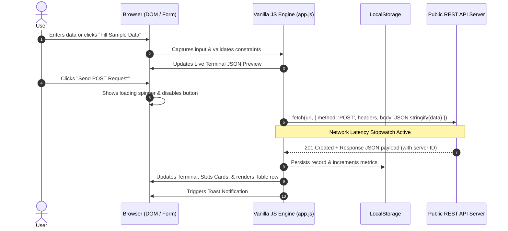

# ⚡ NovaPost — Public REST API POST Portal & Tabular Data Manager

> **Assignment 1**: Public POST API + Form + Tabular Data  
> Built strictly using **Plain HTML5, CSS3 (Vanilla), and Modern JavaScript (ES6+)**. No heavy frameworks, no external CSS libraries.

[](https://developer.mozilla.org/en-US/docs/Web/HTML)
[](https://developer.mozilla.org/en-US/docs/Web/CSS)
[](https://developer.mozilla.org/en-US/docs/Web/JavaScript)
[](LICENSE)

---

## 🎯 Overview & Objectives

NovaPost is a high-performance web application designed to demonstrate the complete lifecycle of **HTTP POST requests** to public REST APIs. It provides:
1. **Dynamic Input Validation**: Validates payloads on the client-side with real-time feedback and character counters.
2. **Multi-Endpoint Support**: Seamlessly switches between public mock endpoints (`DummyJSON Products`, `JSONPlaceholder Posts`, and `ReqRes Users`).
3. **Live Request & Response Inspector**: Visualizes request headers, serialized JSON payload, status codes, latency timings, and returned payloads in a terminal interface.
4. **Interactive Data Table**: Renders server-assigned attributes dynamically with live multi-field search, category filtering, column sorting, JSON inspection modals, CSV export, and persistent storage.
5. **Aesthetic Excellence**: Premium glassmorphism design with responsive CSS Grid/Flexbox, fluid typography (`Plus Jakarta Sans` & `JetBrains Mono`), and Dark/Light mode toggle.

---

## 🚀 Public APIs Used

| Provider | Endpoint | Method | Payload Sample | Response Status |
| :--- | :--- | :--- | :--- | :--- |
| **DummyJSON** | `https://dummyjson.com/products/add` | `POST` | `{"title":"...","price":199.99,"category":"audio"}` | `201 Created` |
| **JSONPlaceholder** | `https://jsonplaceholder.typicode.com/posts` | `POST` | `{"title":"...","body":"...","userId":1}` | `201 Created` |
| **ReqRes** | `https://reqres.in/api/users` | `POST` | `{"name":"...","job":"..."}` | `201 Created` |

---

## 🧠 Architecture & HTTP POST Flow



---

## ✨ Key Features

- **Pure Vanilla Stack**: Zero npm build dependencies required. Runs natively in any modern browser.
- **1-Click Sample Pre-filling**: Instant realistic sample generation for swift testing without tedious manual typing.
- **Live Terminal Inspector**: Real-time inspection of headers (`Content-Type: application/json; charset=UTF-8`), request body, and response payload.
- **Tabular Data Operations**:
  - **Live Search**: Instant substring search across Title, Category, Description, and ID.
  - **Filter**: Narrow records by product/topic category.
  - **Sort**: Click column headers (ID, Timestamp, Title, Price, Status) to toggle Ascending/Descending.
  - **Data Inspection**: Open modal with syntax-highlighted raw JSON and copy-to-clipboard.
  - **Exporting**: Export entire history to downloadable `.csv` spreadsheet or `.json` file.
- **Dark & Light Mode**: Smooth theme transitions persisted in `localStorage`.
- **Educational Guide Modal**: Built-in interactive architectural walkthrough of HTTP POST mechanics, status codes, and `async/await`.

---

## 💻 How to Run Locally

Because this project is built with standard Web APIs (HTML5/CSS3/Vanilla JS), no compilation step is needed:

### Option 1: Using Python's Built-in Server (Recommended)
```bash
# In the project root directory
python -m http.server 8000
```
Then open: `http://localhost:8000`

### Option 2: Using Node.js `npx serve` / `http-server`
```bash
npx serve .
```

### Option 3: Direct File Opening
Simply double-click `index.html` or open it directly in Chrome, Edge, Safari, or Firefox.

---

## 📂 Project Structure

```
d:\Project\Assignment 1/
├── index.html        # Semantic HTML5 markup, accessible forms, modals, tables
├── style.css         # Modern design tokens, glassmorphism, animations, responsive grid
├── app.js            # Modular ES6+ logic (Fetch POST, validation, table manager, storage)
├── README.md         # Detailed project documentation & API guide
```

---

## 🛠️ Code Explanation

### 1. Asynchronous POST Request with Fetch API
```javascript
async function submitData(url, data) {
  try {
    const startTime = performance.now();
    const response = await fetch(url, {
      method: 'POST',
      headers: {
        'Content-Type': 'application/json; charset=UTF-8',
        'Accept': 'application/json'
      },
      body: JSON.stringify(data)
    });

    if (!response.ok) {
      throw new Error(`HTTP error! Status: ${response.status}`);
    }

    const responseData = await response.json();
    const latency = Math.round(performance.now() - startTime);
    return { data: responseData, latency, status: response.status };
  } catch (error) {
    console.error('API POST Failed:', error);
    throw error;
  }
}
```

### 2. Client-Side Validation & Table Rendering
Inputs are validated with HTML5 constraints and JavaScript `checkValidity()` before any network dispatch. When successful, the returned response is normalized and injected into the responsive DOM table with XSS-safe text escaping.

---

## 📦 Pushing to GitHub

To commit and push this assignment to your repository:

```bash
# 1. Initialize git (if not already done)
git init

# 2. Add remote repository
git remote add origin https://github.com/shubhrahazra/Assignment-1.git

# 3. Stage all files
git add .

# 4. Commit changes
git commit -m "feat: complete assignment 1 public POST API portal with modern form and table"

# 5. Push to main branch
git branch -M main
git push -u origin main
```

---

## 👨‍💻 Author

- **GitHub**: [@shubhrahazra](https://github.com/shubhrahazra)
- **Repository**: [https://github.com/shubhrahazra/Assignment-1](https://github.com/shubhrahazra/Assignment-1)

---
*Happy Coding!* 🚀
