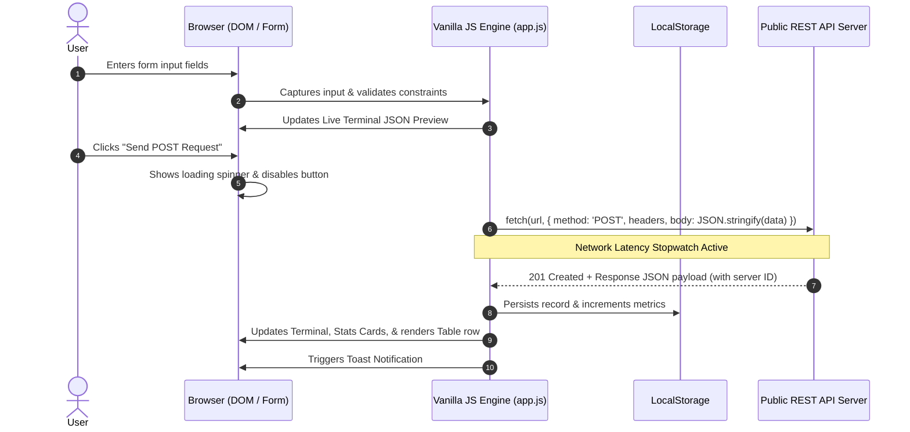

# ⚡ NovaPost — Public REST API POST Portal & Tabular Data Manager

> **Assignment 1**: Public POST API + Form + Tabular Data  
> Built strictly using **Plain HTML5, CSS3 (Vanilla), and Modern JavaScript (ES6+)**. No frameworks, no external CSS libraries.

[](https://developer.mozilla.org/en-US/docs/Web/HTML)
[](https://developer.mozilla.org/en-US/docs/Web/CSS)
[](https://developer.mozilla.org/en-US/docs/Web/JavaScript)
[](LICENSE)

---

## 🎯 Overview & Objectives

NovaPost is a high-performance web application designed to demonstrate the complete lifecycle of **HTTP POST requests** to public REST APIs. It provides:
1. **Dynamic Input Validation**: Validates payloads on the client-side with real-time feedback and character counters.
2. **Multi-Endpoint Support**: Connects to public REST endpoints (`JSONPlaceholder Posts`, `JSONPlaceholder Comments`, and `JSONPlaceholder Todos`).
3. **Live Request & Response Inspector**: Visualizes request headers, serialized JSON payload, status codes, latency timings, and returned payloads in a terminal interface.
4. **Interactive Data Table**: Renders server-assigned attributes dynamically with live multi-field search, category filtering, column sorting, JSON inspection modals, CSV export, and persistent storage.
5. **Aesthetic Excellence**: Premium glassmorphism design with responsive CSS Grid/Flexbox, fluid typography (`Plus Jakarta Sans` & `JetBrains Mono`), and Dark/Light mode toggle.

---

## 🚀 Public APIs Used

| Provider | Endpoint | Method | Payload Sample | Response Status |
| :--- | :--- | :--- | :--- | :--- |
| **JSONPlaceholder (Posts)** | `https://jsonplaceholder.typicode.com/posts` | `POST` | `{"title":"...","body":"...","userId":1}` | `201 Created` |
| **JSONPlaceholder (Comments)** | `https://jsonplaceholder.typicode.com/comments` | `POST` | `{"name":"...","body":"...","email":"...","postId":1}` | `201 Created` |
| **JSONPlaceholder (Todos)** | `https://jsonplaceholder.typicode.com/todos` | `POST` | `{"title":"...","completed":false,"userId":1}` | `201 Created` |

---

## 🧠 Architecture & HTTP POST Flow



---

## ✨ Key Features

- **Pure Vanilla Stack**: Zero npm build dependencies required. Runs natively in any modern browser.
- **Live Terminal Inspector**: Real-time inspection of headers (`Content-Type: application/json; charset=UTF-8`), request body, and response payload.
- **Tabular Data Operations**:
  - **Live Search**: Instant substring search across Title, Category, Description, and ID.
  - **Filter**: Narrow records by category.
  - **Sort**: Click column headers (ID, Timestamp, Title, User ID, Status) to toggle Ascending/Descending.
  - **Data Inspection**: Open modal with syntax-highlighted raw JSON and copy-to-clipboard.
  - **Exporting**: Export table history to downloadable `.csv` spreadsheet or `.json` file.
- **Dark & Light Mode**: Smooth theme transitions persisted in `localStorage`.
- **Educational Guide Modal**: Built-in interactive architectural walkthrough of HTTP POST mechanics, status codes, and `async/await`.

---

## 💻 How to Run Locally

### Option 1: Using Python's Built-in Server (Recommended)
```bash
python -m http.server 8080
```
Then open: `http://localhost:8080`

### Option 2: Direct File Opening
Simply double-click `index.html` or open it directly in Chrome, Edge, or Firefox.

---

## 📂 Project Structure

```
d:\Project\Assignment 1/
├── index.html        # Semantic HTML5 markup, accessible forms, modals, tables
├── style.css         # Modern design tokens, glassmorphism, animations, responsive grid
├── app.js            # Modular ES6+ logic (Fetch POST, validation, table manager, storage)
├── README.md         # Detailed project documentation & API guide
```

---

## 📦 Pushing to GitHub

```bash
git add .
git commit -m "feat: complete assignment 1 with public POST API, modern form, and interactive table"
git branch -M main
git push -u origin main
```

---

## 👨‍💻 Author

- **GitHub**: [@shubhrahazra](https://github.com/shubhrahazra)
- **Repository**: [https://github.com/shubhrahazra/Assignment-1](https://github.com/shubhrahazra/Assignment-1)

---
*Happy Coding!* 🚀
